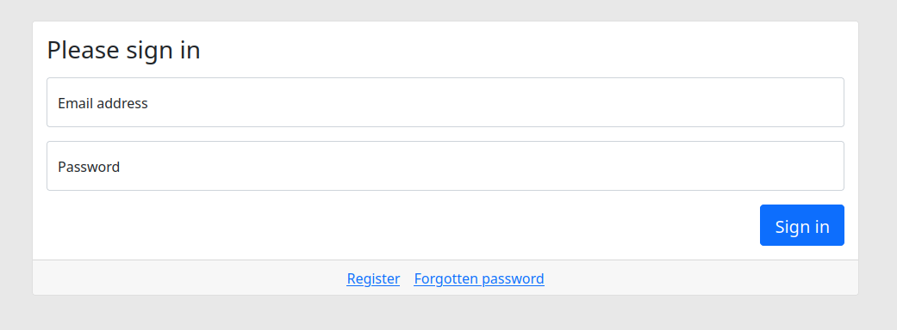
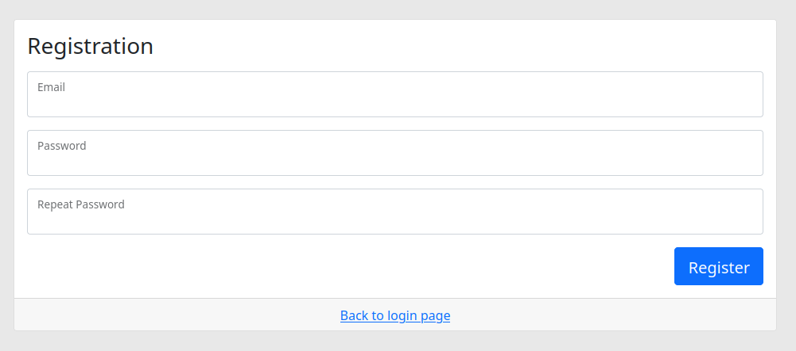
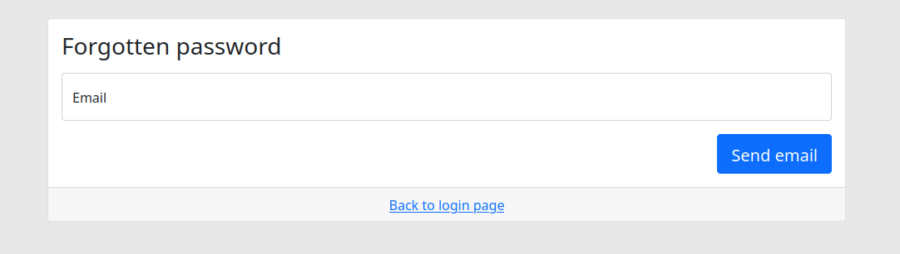
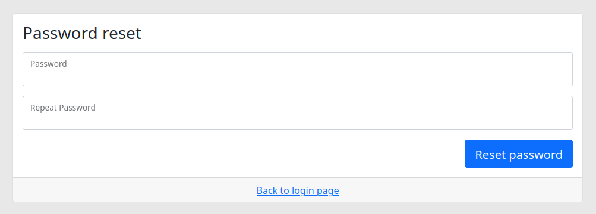
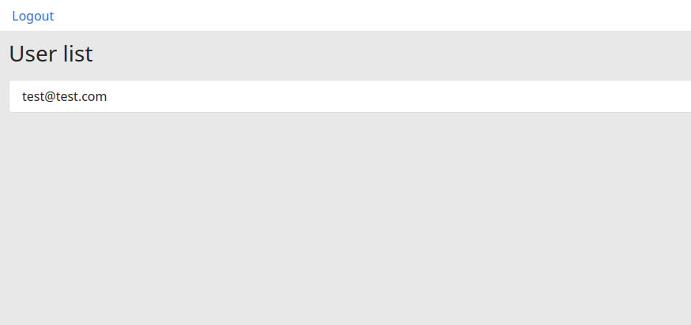

# Login Project

## About

This project aims to show different elements necessary for user management in a symfony project:
- persistence in db 
- registration
- login / logout
- password reset via an email

## What is left to do

Some elements may be added as user management enhancement:
- password effectiveness, as for now a simple character may be used for it
- registration confirmation email
- user management page for admins
- more user data, like username and phone number
- a forgotten password system with SMS
- ...

## Constraints and requirement

Project requirement was to avoid the use of FosUserBundle or other user management tools.

`.env` file must be edited to set up a database for data persistence and a SMTP server for emails.

## Screenshots

